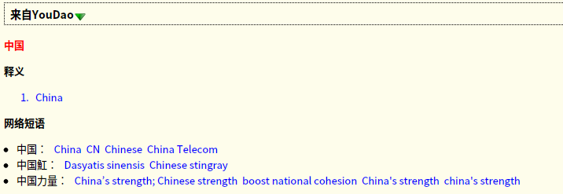
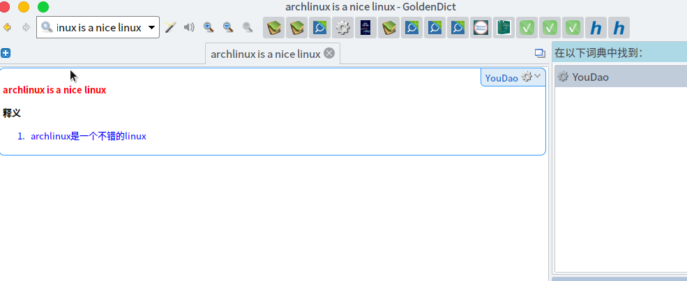

# YouDao4GoldenDict

[TOC]

为Golden Dict写的有道词典插件 ( A plugin for golden dict use youdao interface )

Inspired by [Wudao-dict](https://github.com/ChestnutHeng/Wudao-dict)

## 预览

## 特点：

- 自动检测多种语言并将其翻译为中文
- 可以翻译单词、短语、句子

## 注意

- 这个脚本需要自己注册有道智云的API
- 本程序只是为了配合golden dict用，不会考虑输出为其他格式，需要终端翻译的可以考虑[Wudao-dict](https://github.com/ChestnutHeng/Wudao-dict)
- 尽量不要把这个插件放在第一个词典，这样会由于网络查询造成很明显的时延
- 本程序输出格式为html,请尽量避免在终端中直接阅读

本来[无道词典](https://github.com/ChestnutHeng/Wudao-dict) 格式挺好看的，可惜无道词典是用终端上色的方法，在Golden dict里面看起来就像乱码一样。所以自己写了个脚本，将有道词典返回的json格式化成html，方便在Golden dict里面看

## 使用方法

1. 把`YouDao4GD.py`这个文件下载到 `/usr/bin/`目录下
2. 在[有道智云](http://ai.youdao.com/)注册一个帐号，然后个人账户那里的 ``自然语言翻译->翻译实例``创建一个实例，然后在 ``应用管理->我的应用``哪里创建一个应用。
3. 将创建应用的 ``应用ID`` 填到脚本中的 ``APP_KEY``，``应用密钥``填到 ``APP_SECRET``
4. 打开 `Golden Dict -> 编辑 -> 词典 -> 程序 -> 添加`，然后在新添加的命令行中写上：`YouDao4GD.py %GDWORD%`，并把前面的启用打勾就行了

如图：

